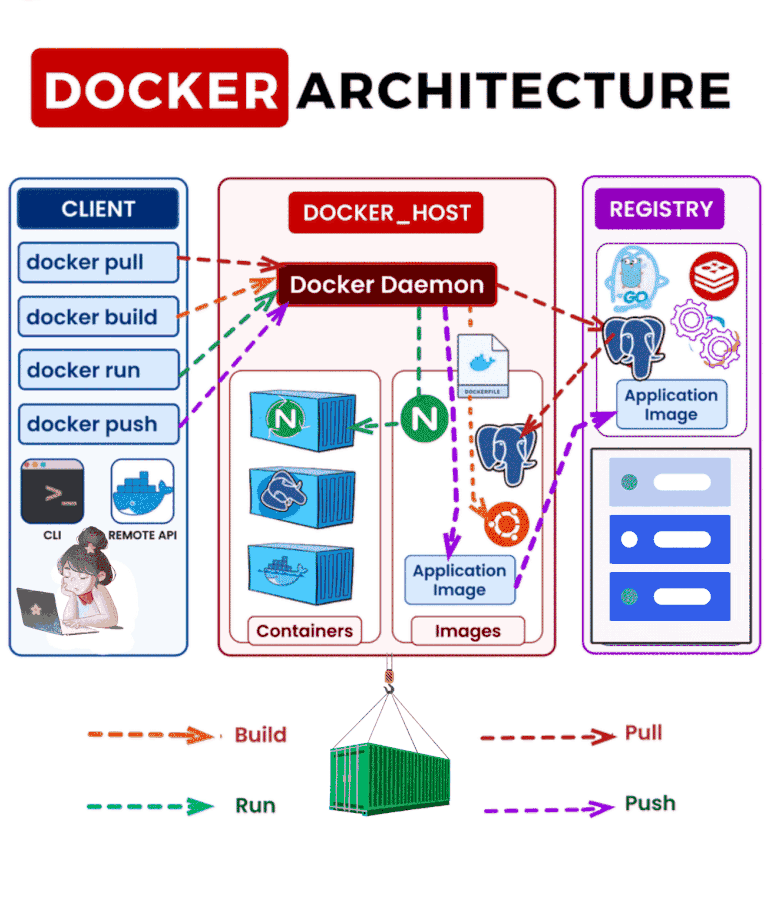
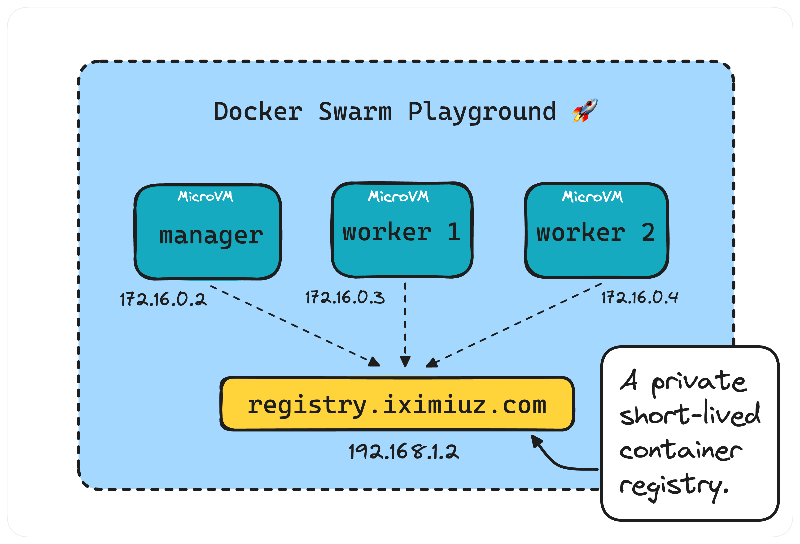

# Fullstack Development

---

# Docker

---

# Content

- Docker recap
- Docker build
- Docker vulnerabiltiy
- Docker Swarm

---

---

# Docker Tutorial

[Another Todo App](https://gist.github.com/potikanond/02c55377ab53bba5284caa42f4a48543)
[Awesome Compose](https://github.com/docker/awesome-compose)

---

# Docker vulnerability

Generally fall into 3 categories:

- Outdated container runtime or engine software (breakouts)
- Vulnerable 3rd-party application dependencies (image & libs)
- System misconfigurations (`:latest` tag, mount `/var/run/docker.sock`)

---

# Remediation & Practice

- Integrate (automated) docker image security scanners
  - `trivy`, `Docker Scout`
  - [Visscan Project](https://visscan.cpe.eng.cmu.ac.th/)
    - `Semgrep` : scans source code from git repository
    - `trivy` : if `Dockerfile` is available, build and scans docker image

---

# Docker compose scaling

- The process of horizontally expanding/shrinking your app by running **multiple instances** of the same containerized service
- By default, `docker compose` spins up exactly one container per service

---

# Docker compose scaling - How to

- No **static host ports** (like `"8080:80"`)
  - Instead expose only container port (`"80"`)
  - Docker assigns random host posts automatically
- No **custom container names** (like `container_name: my_app`)
  - Docker manages names by adding suffixes (`web-1`, `web-2`) when scaling
- Requires a **load balancer** (`nginx`, `caddy`, `traefik`)

---

# Docker compose scaling - example

[Demo](https://gist.github.com/potikanond/9702c0370f19fda84dd2f792ea7c113c)

---

# Docker Swarm

- Docker's native **container orchestration tool**
- Manages a cluster of multiple Docker engines/hosts as a single virtual system
  - Control deployment, scailing, networking, HA

---

# Docker Swarm Tutorial

- [Swarm Tutorial](https://gist.github.com/potikanond/bded98b4b82211af754e506beff8e92f)
- [Docker Swarm Playground](https://labs.iximiuz.com/playgrounds/docker-swarm)

---
