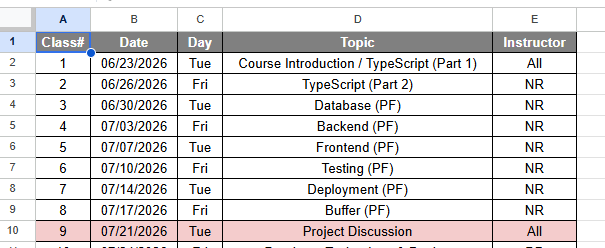

# Fullstack Development

---

# Self Evaluation

### Roadmap

https://roadmap.sh/full-stack

### Form

https://forms.office.com/r/kZCevp7tcU

---

# 2568 Result

---

# Preflight Project

---

# Preflight Project

---

# Objective

> Develop "end-user-ready" full-Stack application in 1 months.

- [Ideas](https://github.com/ZOUHAIRFGRA/100-Project-Ideas-for-Full-Stack-Developers)

---

# Why?

- Give students experience of the overview of the full-stack technology.
  - Before going into "real" project.
- Want smaller groups ➡️ better learning experience.
- Give students more chance to iterate ➡️ better coding decision in the `project`.

---

# Requirement

- Full stack technology
  - Anything that you can run on local development environment.
  - No cloud service (e.g. Firebase)
  - If using JavaScript frameworks, use TypeScript.
- Automated Testing
  - API testing
  - UI testing

---

# Requirement (cont)

- Deployment
  - Deploy on CPS virtual machine (Ubuntu).
  - No Netlify, Vercel, Railway
- Source code repository
  - GitHub
  - GitLab
- CI/CD _(Optional)_
  - Github action

---

# Last Year's Projects

- [Fullstack 68](https://youtube.com/playlist?list=PLNGLpHQhvGrudVf6q3Y350Q1R7hOkG0Ec&si=5c8HM29iFEwHwIOm)
  - _Check `G3`, `G5`_

- [Fullstack 67](https://youtube.com/playlist?list=PLNGLpHQhvGrsBYoetbinh5A02H59bneg6&si=YrUCcnxJpP5RqHMo).
  - _Check `G2`, `G9`, `G11`_

---

# Due Date (Tentative)

> Sunday 19 July 2026, 11:59 PM

---

## Deliverables

- URL to your deployed application
- URL to your source-code repositories
- URL to your VDO
  - File-downloadable (ผมขอเก็บไฟล์)
  - ความยาวไม่เกิน 10 นาที (Please)

---

# VDO Checklists (1)

- Introduction
  - แนะนำสมาชิกในกลุ่ม
  - ทำแอปอะไร สาธิตการทำงาน (Show me your CRUD!)
  - สรุป Technology Stack

---

# VDO Checklists (2)

- Database
  - ใช้ Database อะไร
  - มีโครงสร้างข้อมูลเป็นอย่างไร (e.g. แสดงหน้าใน Dbeaver)
  - ใช้ ORM อะไร
  - มีอะไรที่อยาก Show เทพ (แตกต่างจากที่สอน)

---

# VDO Checklists (3)

- Backend
  - ใช้ Framework อะไร
  - มี Endpoint อะไรบ้าง (สามารถอธิบายจาก Code หรือเขียน Diagram)
  - มีอะไรที่อยาก Show เทพ (แตกต่างจากที่สอน)
- Frontend
  - ใช้ Framework อะไร
  - อธิบาย Structure ของ Code คร่าวๆ
  - มีอะไรที่อยาก Show เทพ (แตกต่างจากที่สอน)

---

# VDO Checklists (4)

- Testing
  - ใช้ Framework อะไร
  - มี การ Test API อะไรบ้าง
  - มี การ Test UI อะไรบ้าง
  - มีอะไรที่อยาก Show เทพ (แตกต่างจากที่สอน)

---

# VDO Checklists (5)

- Deployment
  - ใช้ Technology อะไร (e.g. Docker)
  - อธิบาย Step ของการ Deployment
    - แสดง `Dockerfile`, `docker-compose.yml`
    - อธิบายการสร้าง Image/Container, etc.
  - มีอะไรที่อยาก Show เทพ (แตกต่างจากที่สอน)

---

# VDO Checklists (6)

- CI/CD (Optional)
  - Show ว่าพอ Commit ใน Repository แล้วแอปอัพเดตได้

---

# ถ้าอยากใช้ Server ของตนเอง

> การ Deploy ระบบของ Prelight Project ไม่จำเป็นต้องใช้ CPE Server เสมอไป หากมี Server ของตนเอง ก็สามารถนำมาใช้ได้เช่นกัน โดยมีเงื่อนไขดังต่อไปนี้

- ต้องเป็น Server หรือ Virtual Machine ที่เรามีสิทธิ์เป็นแอดมินเต็มรูปแบบ
- ไม่สามารถใช้บริการ Cloud ที่เป็นลักษณะ Fully Managed Deployment Automation เช่น Vercel, Railway, หรือ Cloudflare
- ต้องใช้เทคโนโลยี Container ตัวอย่างเช่น Docker หรือ Kubernetes
- ต้องมีการเชื่อมโยงกับ GitHub Actions เพื่อให้รองรับระบบอัตโนมัติสำหรับการ Build และ Deploy
  - สามารถใช้ Self-hosted Runner หรือจะใช้ Runner ของ GitHub ก็ได้
- ต้องมี Public URL สำหรับเข้าถึง Application

---

# Grade

- 20%

---

# Extra credit

- Nice-looking UI design
- More complex data relationship (e.g. join tables)
- Includes Authentication / Authorization
- Use different stacks than the class example.

---

# Timeline

[Check this link for the most updated timeline](https://docs.google.com/spreadsheets/d/1OBcuKyYxc9wJbu_fCjz29MCMtE-3qUPd2xA8cRQzfKk/edit?usp=sharing)

_Updated 2026-06-22_

---

# Group assignment

> Go to Mango Canvas

---

# Tools

- Terminal
  - (Windows) Powershell 7 + Chocolatey (Package Manager) (Guide)
  - (Mac/Linux) Zsh
- Editor
  - VSCode
  - Cursor
  - Antigravity

---

# Tools

- Containerization Platform
  - Docker (Desktop)
  - Podman (Desktop)
- Node.js
- Git

---

# Tools

- Database client
  - Dbeaver
- API Testing tool
  - Insomnia
  - Postman
  - Thunder client (VSCode extension)

---

# AI Assistant

> Disclaimer: Nirand's take

- Try to avoid AI autocomplete tools (GitHub Copilot Extension, Cursor) during the learning phase.
  - Save some 💵💵💵.
- Use AI as a learning assiantant.
  - Ask AI to explain code.
  - Ask AI question about the code.
  - Ask AI to improve code.
- Do not copy/paste without understanding the code.
