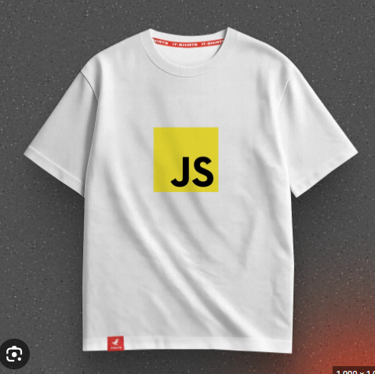
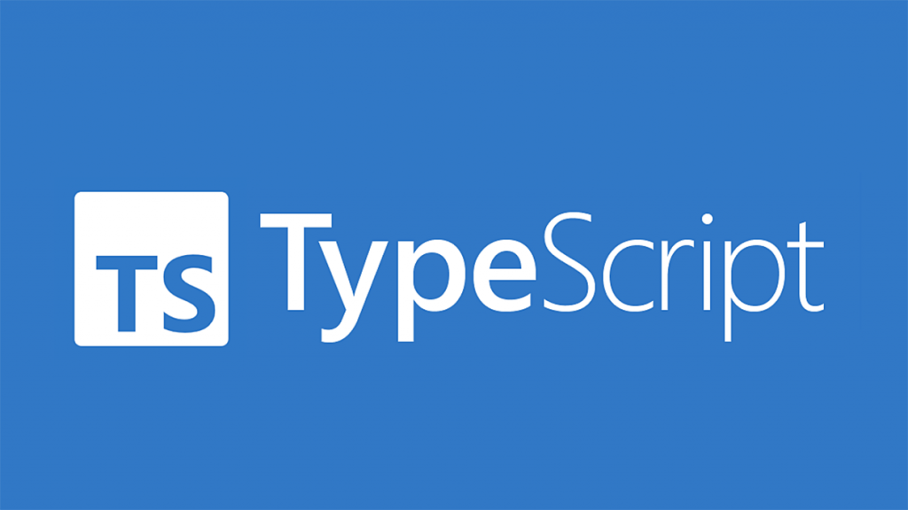
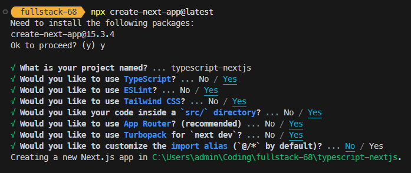

<style>
@import url('https://fonts.googleapis.com/css2?family=Prompt:ital,wght@0,100;0,300;0,400;0,700;1,100;1,300;1,400;1,700&display=swap');

    :root {
    font-family: Prompt;
    --hl-color: #D57E7E;
}
h1 {
  font-family: Prompt
}
img {
  border-radius: 0.5rem; 
}
</style>

# Fullstack Development

---

## 

---

# History

- https://roadmap.sh/guides/history-of-javascript
- https://www.w3schools.com/js/js_versions.asp

---

# Fun Facts

- The brand `JavaScript` is owned (trademarked) by `Oracle`.
  - The standard that governs JavaScript has to be called something else: `ECMAScript (ES)`.
  - The world's most famous JavaScript events cannot be called "JavaScript Conference" or "JavaScript Summit". (Use `JSConf` instead)



---

# Fun Facts

- Who is maintaining JavaScript today?
  - TC39 (Technical Committee 39) ➡️ ES Standard
  - Google ➡️ V8 Engine
  - WC3C ➡️ Web APIs
  - The OpenJS Foundation ➡️ NodeJS
---

# Where is `JS`?

- Browser
  - Manipulate DOM.
- Host OS
  - JavaScript runtimes ([NodeJS](https://nodejs.org/en), [Bun](https://bun.sh/), [Deno](https://deno.land/), ...)

---

# Activity

- Run `console.log` in a browser
- Run `console.log` in a terminal.

---

# JS Roadmap

- https://roadmap.sh/javascript
- https://roadmap.sh/questions/javascript

---

## 

---

# What is TypeScript?

- TypeScript is a super set of JavaScript.
- Developed and maintained by `Microsoft`.
---

# Why TypeScipt?

- Improves your productivity while helping avoid bugs.
  - Catch bugs at the compile-time instead of at runtime.
- Brings the future JavaScript to today.
  - You can use the new JavaScript features before web browsers (or other environments) fully support them.
- [More competitive in job market](https://www.libhunt.com/index).
- [Release History](https://en.wikipedia.org/wiki/TypeScript#Release_history)

---

# How it works?

1. Write TypeScript codes. (`.ts` files)
2. Compile the TypeScript codes into plain JavaScript codes (`.js` files) using a TypeScript compiler.
3. Run JavaScript codes in an environment that JavaScript runs.

---

# Node 23+

- Node 23+ has built-in support for TypeScript. You can run TypeScript files directly using the `node` command without needing to compile them first.

---

# Tools

- TypeScript Playground: https://www.typescriptlang.org/play
- VSCode Extension
  - `Quokka.js` / `TypeScript Worksheet`
  - `Pretty TypeScript Errors`

---

# Demo

---

```ts
let a = 10;
a.slice(0, 1); // See error message
```

```ts
let a: number;
a = "Hello"; // See error message
```

```ts
let a: number;
// Try typing "a" and trigger intellisense.
```

---

# Defining types

- Types by inference
  - TypeScript knows the JavaScript language and will generate types for you in many cases.
- Type by specification
  - We define it ourselves.
  - Keywords `type`, `interface`

---

# Type by inference

```js
const user = {
  name: "Hayes",
  id: 0,
};

user.name = 20; // Error
console.log(user.food); // Error
```

- TypeScript already knows the type of this variable.

---

# Type by specification

```ts
interface User {
  name: string;
  id: number;
}
```

or

```ts
type User = {
  name: string;
  id: number;
};
```

---

# Type Annotation

```ts
interface User {
  name: string;
  id: number;
}

// type User = {
//   name: string;
//   id: number;
// };

const user: User = {
  name: "Hayes",
  id: 0,
  age: 30, // Error
};
```

---

# `type` vs `interface`

- They are very similar, and for the most common cases act the same.
- However, TypeScript doc recommends `interface`.
  - `interface` provides better error message.
  - `interface` can be extended.

---

# More type demo

- https://github.com/fullstack-68/typescript-intro/blob/main/lecture/03_more_type_demo.ts

---

# Type utilities

```ts
interface User {
  id: number;
  name: string;
}

// Extend
interface UserExtended extends User {
  isActive: boolean;
}
```

[More information](https://www.typescriptlang.org/docs/handbook/utility-types.html)

---

# Function (argument type)

```ts
// Give warning
function sumNumber(a, b) {
  return a + b;
}

// OK
function sumNumber(a: number, b: number) {
  return a + b;
}
```

---

# Function (type guards)

```ts
// Hover cursor on "text" to see the type
function greeter(text: string | null | undefined) {
  if (!text) {
    console.log("...");
    return;
  }
  console.log(text);
}
```

---

# Generics

Generics provide variables to types.

```ts
interface Backpack<Type> {
  items: Type[];
  add: (obj: Type) => void;
  get: () => Type;
}

const backpack: Backpack<string> = {
  items: ["1", "2"],
  add: (myStr) => {
    myStr.slice(0, 1);
  },
  get: () => {
    return "Hi";
  },
};
```

---

# Use Typescript in NodeJS project

---

# Setup

- `npm i -g pnpm` _(Alternative package manager)_
- `pnpm init --init-type module`
  - Note: `package.json` will have `"type": "module"`.
- `pnpm install -D typescript @types/node`
- Create `./src` directory

---

- Create `./src/index.ts`

```ts
function sayHello(name: string) {
  console.log("Hello " + name);
}

sayHello("World");
```

---

## Compile

- `npx tsc src/index.ts --outDir dist`

## Run (node)

- `node ./dist/index.js`

## Run (tsx)

- `npx tsx ./src/index.ts`

---

# Use TS configuration file

- `npx tsc --init`

- Modify `tsconfig.json`

```json
{

  // Other Outputs (Commented out)
  // "sourceMap": true,
  // "declaration": true,
  // "declarationMap": true,

  "compilerOptions": {
    "rootDir": "./src",
    "outDir": "./dist"
  },
  "include": ["./src/**/*"]
}
```

---

# Use TS configuration file (cont)

- Now just type `npx tsc`
- Use `npx tsc --showConfig` to see config.

---

# Code - Async

```js
async function getData() {
  const res = await fetch("https://jsonplaceholder.typicode.com/todos/1");
  return await res.json();
}

getData().then((data) => console.log(data));
```
- Try changing `"target": "es6"` and see the generated code.

---

# Code - Import

`./src/lib.ts`

```js
export const name = "Tom";
```

`./src/index.ts`

```js
import { name } from "./lib.js";

sayHello(name);
```
---
# Note on import statement


```js
import { name } from "./lib.js";
```

- Notice the `.js` extension in the import statement. This is required when using ES modules in NodeJS `"module": "nodenext"`. 
- If you change it to `"module": "esnext"`, you can omit the extension, but it may cause issues in some environments.
---

# Code - FS

```js
import * as fs from "fs";
import { fileURLToPath } from "url";
import { dirname } from "path";
const __filename = fileURLToPath(import.meta.url);
const __dirname = dirname(__filename);

const dir = fs.readdirSync(__dirname);
console.log(dir);
```

- Enable
```    
  "lib": ["esnext"],
  "types": ["node"],
```
---

# Using TSconfig template

- `pnpm install @types/node @tsconfig/node-lts @tsconfig/node-ts` _([What](https://github.com/tsconfig/bases))_

`./tsconfig.json`

```json
{
  "extends": [
    "@tsconfig/node-lts/tsconfig.json",
    "@tsconfig/node-ts/tsconfig.json"
  ],
  "compilerOptions": {
    "outDir": "./dist"
  },
  "include": ["./src/**/*"]
}
```

---

# TypeScript - NextJS

---

# Installation

`npx create-next-app@latest`



---

`./tsconfig.json`

```json
{
  // ...
  "paths": {
    "@app/*": ["./src/app/*"],
    "@components/*": ["./src/components/*"]
  }
}
```

---

`./src/app/globals.css`

```css
@import "tailwindcss";

// Remove everything else
```

---

`./src/components/card.tsx`

```ts
import { FC } from "react";

interface Props {
  title: string;
  text?: string;
}

const Card: FC<Props> = ({ title, text }) => {
  return (
    <div className="border border-gray-300 p-2 rounded shadow-sm flex flex-col items-center">
      <div className="font-bold text-lg text-gray-800">{title}</div>
      <div className="text-gray-600">{text ?? "...."}</div>
    </div>
  );
};

export default Card;
```

---

`./src/app/page.tsx`

```js
import Card from "@components/Card";

export default function Home() {
  return (
    <div className="container flex m-2 gap-2">
      <Card title="Card 1" />
      <Card title="Card 2" text="Content Here" />
    </div>
  );
}
```
