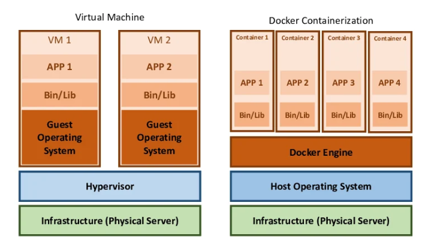
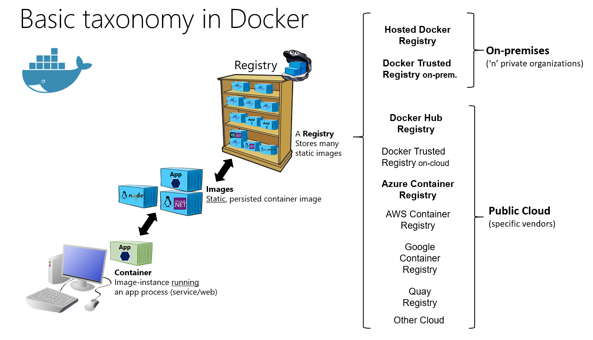
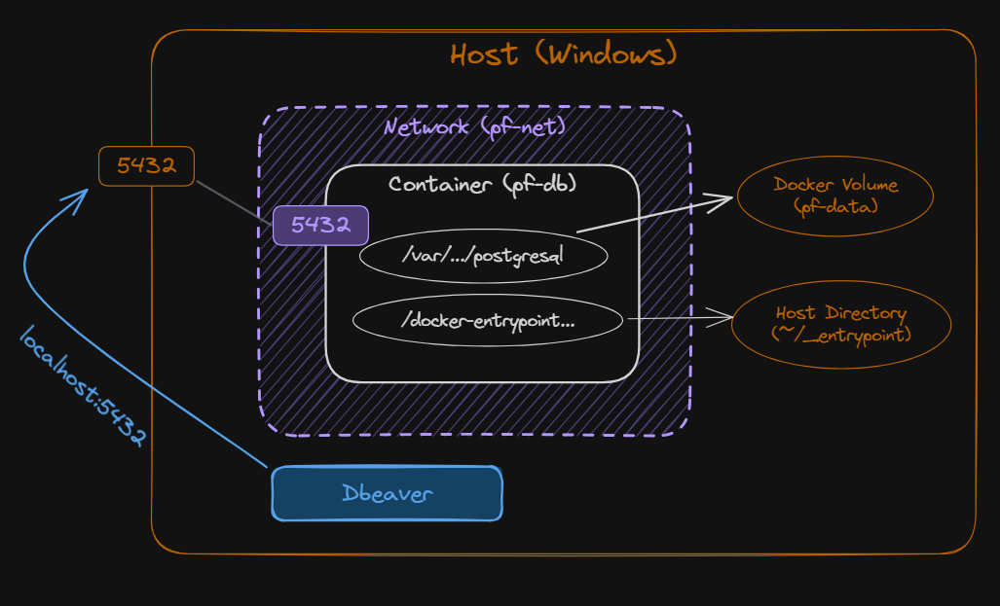
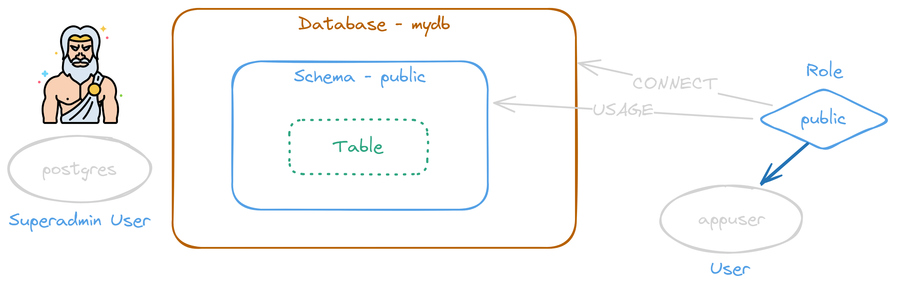
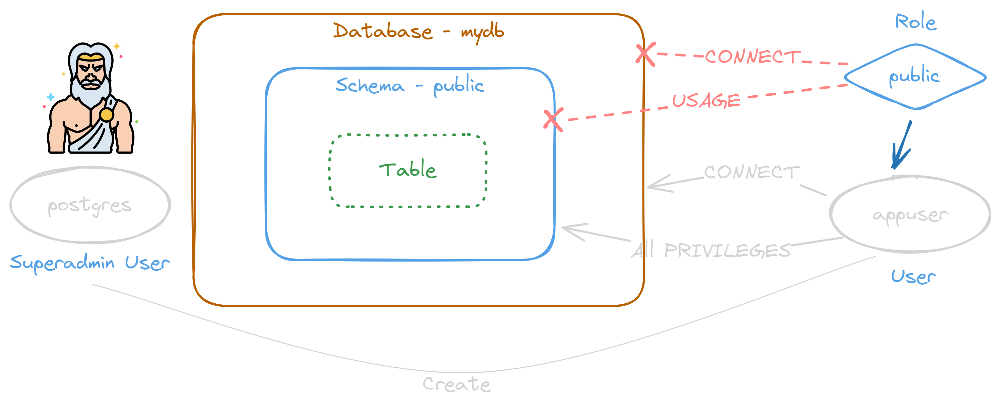
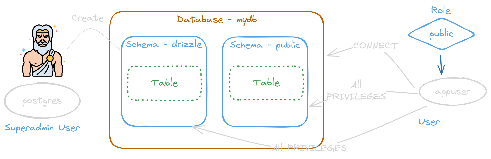
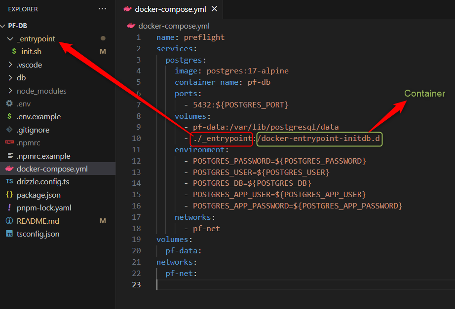

<style>
@import url('https://fonts.googleapis.com/css2?family=Prompt:ital,wght@0,100;0,300;0,400;0,700;1,100;1,300;1,400;1,700&display=swap');

    :root {
    font-family: Prompt;
    --hl-color: #D57E7E;
}
h1 {
  font-family: Prompt
}
img {
  border-radius: 0.5rem; 
}
</style>

# Fullstack Development

---

# Preflight Project - Database

[Github Repo](https://github.com/fullstack-69/pf-db)

---

# Prerequisite

- Docker
  - Docker desktop
- Database management tools
  - Dbeaver

---

# Popularlity

- [SO Survey 2025](https://survey.stackoverflow.co/2025/technology#1-databases)

# Choices

- Relatonal database
  - PostgreSQL / MariaDB / MySQL / SQLite
- NoSQL
  - [Types](https://www.geeksforgeeks.org/types-of-nosql-databases/)
  - [Vendors](https://www.geeksforgeeks.org/open-source-nosql-databases/)

---

# Docker 101

---

# Containers

Provide a way of creating an isolated environment in which applications and their dependencies can live.



---

# Why containers?

- Portability (save container to registry or even USB)
- Consistency (works everywhere)
- Easy deployment (can test on local machine)
- More efficient (than virtual machines).

---

# Docker

- A containerization platform
  - Leading player
- Alternative `Podman`

---



---

# Should you run database on docker container?

> [It depends.](https://devops.stackexchange.com/a/3374)

---

# Spinning up database instance

- Files
  - 💾 `./.env` Copy from [here](https://github.com/fullstack-69/pf-db/blob/main/.env.example).

  - 💾 `./.gitignore` [(link)](https://github.com/fullstack-69/pf-db/blob/main/.gitignore)

  - 💾 `./docker-compose.yml` [(link)](https://github.com/fullstack-69/pf-db/blob/main/docker-compose.yml)

  - 💾 `./_entrypoint/init.sh` [(link)](https://github.com/fullstack-69/pf-db/blob/main/_entrypoint/init.sh)
    - _Windows: Make sure that you save with LF option. [(What?)](https://stackoverflow.com/a/1552775)_
    - _Mac:_ `chmod +x ./_entrypoint/init.sh`

- ⌨️ `docker compose up -d`

---

# Note on Docker Commands

- `docker compose up -d` to start the container in detached mode.
- `docker compose down` to stop the container.
  - `docker compose down -v` to remove the volume as well. (Careful, you will lose all data in the database.)
- `docker compose restart` to restart the container.
- `docker compose logs -f` to view the logs of the container.
- `docker compose exec pf-db bash` to enter the db container.

---

# Note on Docker Commands

- `docker volume ls` to list all volumes.
- `docker volume prune` to remove all unused volumes.
- `docker network ls` to list all networks.
- `docker network prune` to remove all unused networks.

---



---

# Database User Management

---



---



---



---

- We want to execute this when a postgres container is freshly created. _(Not restarted)_

```sql
REVOKE CONNECT ON DATABASE mydb FROM public;
REVOKE ALL ON SCHEMA public FROM PUBLIC;
CREATE USER appuser WITH PASSWORD '1234';
CREATE SCHEMA drizzle;
GRANT ALL ON DATABASE mydb TO appuser;
GRANT ALL ON SCHEMA public TO appuser;
GRANT ALL ON SCHEMA drizzle TO appuser;
```

---

Any script files in `_entrypoint` will be executed automatically, when a docker container is freshly created. _(Not restarted)_



---

# Manual DB User Management

> No longer needed

---

- `docker compose exec pf-db bash` (or `docker exec -it pf-db bash`)
- `psql -U postgres -d mydb`
  - Note that you do not need to input password here due to how the image is [setup](https://hub.docker.com/_/postgres). (See section in `POSTGRES_PASSWORD`)

- Don't forget to change the password for `appuser`.

```sql
REVOKE CONNECT ON DATABASE mydb FROM public;
REVOKE ALL ON SCHEMA public FROM PUBLIC;
CREATE USER appuser WITH PASSWORD '1234';
CREATE SCHEMA drizzle;
GRANT ALL ON DATABASE mydb TO appuser;
GRANT ALL ON SCHEMA public TO appuser;
GRANT ALL ON SCHEMA drizzle TO appuser;
```

---

# Note on `psql`

- `\l` to list all databases
- `\du` to list users
- `\dn` to list schema
- `\dt` to list tables
- `\c` to view connected database or change to another db.
- `\q` to quit

---

# ORM

- `Object Relational Mapper`
- A piece of software designed to translate between the data representations used by databases and those used in programming (in our case, Typescript).

---

# Why ORM?

- Get type information when interacting with database.
- Write schema file
  - Good for documentation
- Nice Tooling
  - Database synchronization
  - Schema generation from existing database
  - Database viewer
  - Migration tool

---

# Should you use ORM?

> [It depends.](https://stackoverflow.com/a/1279678)

---

# JavaScript / TypeScript ORM

- [Ranking](https://bestofjs.org/projects?page=1&limit=30&tags=orm&sort=total)

---

# Setting up Drizzle

- `pnpm init`
- `pnpm install dotenv drizzle-orm postgres`
- `pnpm install -D drizzle-kit typescript tsc-alias tsx @types/node @tsconfig/node-lts @tsconfig/node-ts eol-converter-cli`
- `pnpm approve-builds`

---

# Main Packages

- `drizzle-orm` - The ORM itself
- `drizzle-kit` - CLI tool for database synchronization and migration
- `postgres` - Node.js Postgres client

---

# Other Packages

- `dotenv` - Load environment variables from `.env` file
- `tsc-alias` - A tool to replace path aliases in compiled JavaScript files
- `tsx` - A tool to run TypeScript files directly
- `eol-converter-cli` - A tool to convert line endings in files

---

`./tsconfig.json`

```json
{
  "extends": [
    "@tsconfig/node-lts/tsconfig.json",
    "@tsconfig/node-ts/tsconfig.json"
  ],
  "compilerOptions": {
    "types": ["node"],
    "rootDir": ".",
    "outDir": "./dist",
    "paths": {
      "@db/*": ["./db/*"]
    }
  },
  "include": ["./db/**/*", "./drizzle.config.ts"]
}
```

---

# Database initialization

- Files
  - 💾 `./db/utils.ts` [(Link)](https://github.com/fullstack-69/pf-db/blob/main/db/utils.ts)
  - 💾 `./db/schema.ts` [(Link)](https://github.com/fullstack-69/pf-db/blob/main/db/schema.ts)
  - 💾 `./drizzle.config.ts` [(Link)](https://github.com/fullstack-69/pf-db/blob/main/drizzle.config.ts)

---

# Database initialization

`package.json`

```json
{
  "scripts": {
    "db:generate": "drizzle-kit generate",
    "db:push": "drizzle-kit push",
    "db:migrate": "drizzle-kit migrate",
    "db:prototype": "tsx ./db/prototype.ts",
    "build": "tsc && tsc-alias",
    "eol": "eolConverter _entrypoint/*.sh"
  }
}
```

---

# Database synchronization

- ⌨️ `pnpm run db:push`

---

# Database migration

- Migration is like a _version control_.
  - Why do we need it since we already have database schema?

- Migrations ensures that database schema changes are tracked and reversible.

---

# Migration

- ⌨️ `pnpm run db:generate`
- ⌨️ `pnpm run db:migrate`

---

# Side note

- Migration rollback is not yet [available officially](https://github.com/drizzle-team/drizzle-orm/discussions/1339). (June 2026)
- You can try [drizzle-rollback](https://www.npmjs.com/package/drizzle-rollback).

---

# CRUD

- 💾 `./db/client.ts` [(Link)](https://github.com/fullstack-69/pf-db/blob/main/db/client.ts)
- 💾 `./db/prototype.ts` [(Link)](https://github.com/fullstack-69/pf-db/blob/main/db/prototype.ts)
- `pnpm run db:prototype`
  - Note that you cannot use `node` to run `./db/prototype.ts` since it uses alias.

---

# Build

- `pnpm run build`
  - Notice that `tsc-alias` will replace the alias with relative path in the compiled JavaScript files.
- `node dist/db/prototype.js`
