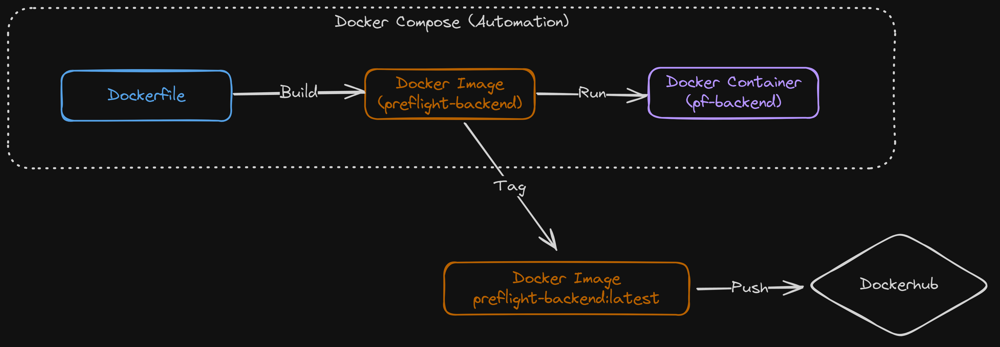
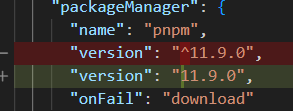
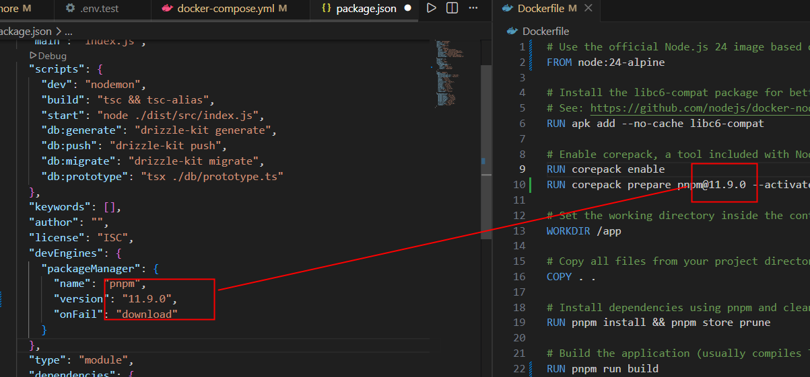
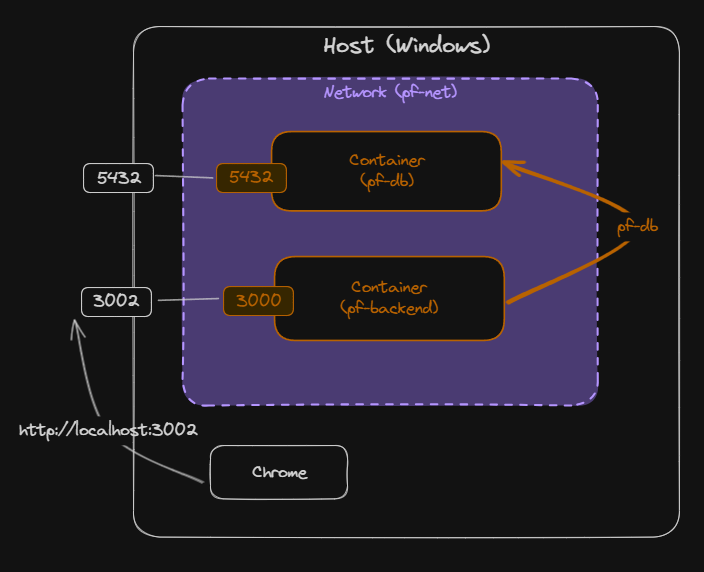

# Fullstack Development

---

# Preflight project - backend

[Github Repo](https://github.com/fullstack-69/pf-backend)

---

# Backend applications

- Data storage
- Business logic
- Authentication / authorization
- APIs for frontend frameworks (_depending on architecture_)
- Connection to other services

---

# Node JS backend frameworks

- [Github stars](https://github.com/vanodevium/node-framework-stars)
- [State of JS 2025](https://2025.stateofjs.com/en-US/libraries/back-end-frameworks/)

---

# Packages

- `pnpm init`
- Express JS
  - `pnpm i express cors helmet morgan debug`
- Typescript
  - `pnpm i typescript @tsconfig/node-lts @tsconfig/node-ts tsx tsc-alias`
  - `pnpm i -D @types/cors @types/express @types/debug @types/morgan @types/node cross-env nodemon`
- ORM
  - `pnpm i drizzle-orm postgres dotenv`
  - `pnpm i -D drizzle-kit`

---

# Package explanation

| Package   | Details                                     |
| --------- | ------------------------------------------- |
| `express` | Express _(duh!)_                            |
| `helmet`  | Set default HTTP response header            |
| `cors`    | Enable Cross-origin resource sharing (CORS) |
| `morgan`  | HTTP request logger                         |
| `debug`   | Debugging utility                           |
| `nodemon` | Script monitoring during dev                |

---

# ORM code

- All [files](https://github.com/fullstack-69/pf-backend/tree/main/db) in `./db` folder.
  - You can change schema.
- `./drizzle.config.ts` [(Link)](https://github.com/fullstack-69/pf-backend/blob/main/drizzle.config.ts)

---

# Files

- 💾 `./.env` (Copy from [here](https://github.com/fullstack-69/pf-backend/blob/main/.env.example))
- 💾 `./nodemon.json` [(Link)](https://github.com/fullstack-69/pf-backend/blob/main/nodemon.json)
- 💾 `./.gitignore` [(Link)](https://github.com/fullstack-69/pf-backend/blob/main/.gitignore)
- 💾 `./tsconfig.json` [(Link)](https://github.com/fullstack-69/pf-backend/blob/main/tsconfig.json)
- Scripts in `package.json` [(Link)](https://github.com/fullstack-69/pf-backend/blob/257d337b8284025757bebda13b4373d9aada1d78/package.json#L7-L13)

---

# Minimal example

- 💾 `./src/index.ts` [(Link)](https://github.com/fullstack-69/pf-backend/blob/main/src/index.min.ts)
- Sync database (if you have not done so)
  - `pnpm run db:push`
- Start dev
  - `pnpm run dev`

---

# Full example

- 💾 `./src/index.ts` [(Link)](https://github.com/fullstack-69/pf-backend/blob/main/src/index.ts)
- Build
  - `pnpm run build`
- Start production
  - `pnpm run start`

---

# API Spec

- [Insomnia](https://github.com/fullstack-69/pf-backend/blob/main/api_spec/Insomnia_2026-07-02.yaml)
- [Postman](https://github.com/fullstack-69/pf-backend/blob/main/api_spec/postman_2026-07-02.json)

---

# Debugging (optional)

- 💾 `./.vscode/launch.json` ([Link](https://github.com/fullstack-69/pf-backend/blob/main/.vscode/launch.json))

---

# Migration

- Run before the containerization step.
- `pnpm run db:generate`

---

# Containerization

---

---

# Steps

- 💾 `./Dockerfile` [(Link)](https://github.com/fullstack-69/pf-backend/blob/main/Dockerfile)
- 💾 `./dockerignore` [(Link)](https://github.com/fullstack-69/pf-backend/blob/main/.dockerignore)
- 💾 `./docker-compose.yml` [(Link)](https://github.com/fullstack-69/pf-backend/blob/main/docker-compose.yml)
- 💾 `./.env.test` from `./.env.test.example` [(Link)](https://github.com/fullstack-69/pf-backend/blob/main/.env.test.example)
- ⌨️ `docker compose --env-file ./.env.test up -d --force-recreate --build`

---

# Corepack

- In a `Node-Alpine` Dockerfile, `Corepack` is an official Node.js tool used to install and manage package managers like pnpm and yarn.
- Corepack require an exact SemVer format (e.g., `10.0.0` or pnpm@9.1.0).
  - They will crash if they encounter a range modifier or invalid syntax.

---

# Dockerfile

- Double check the `pnpm` version in your local machine and the Dockerfile.
  

---

# Network

- Notice the port `3002`/`3000`.
- _Can you find where these ports are specified?_

---

# Automated database migration

- We want to make sure that database migrations are run automatically every time the container starts.
- We use the `post_start` hook in `docker-compose.yml`

---

# Dockerhub

- Create an account at https://hub.docker.com.
- Create repository called `preflight-backend`.
- Login to your account in terminal
  - `docker login`

---

# Push to Dockerhub

- Tag image
  - ⌨️ `docker tag preflight-backend [DOCKERHUB_ACCOUNT]/preflight-backend:latest`
- `docker login`
- Push image
  - ⌨️ `docker push [DOCKERHUB_ACCOUNT]/preflight-backend:latest`

---

# Userful docker commands

- Inspect
  - `docker ps`
  - `docker network ls`
  - `docker volume ls`

- Cleaning
  - `docker image prune -a`
  - `docker builder prune`
  - `docker volume prune`
  - `docker network prune`
