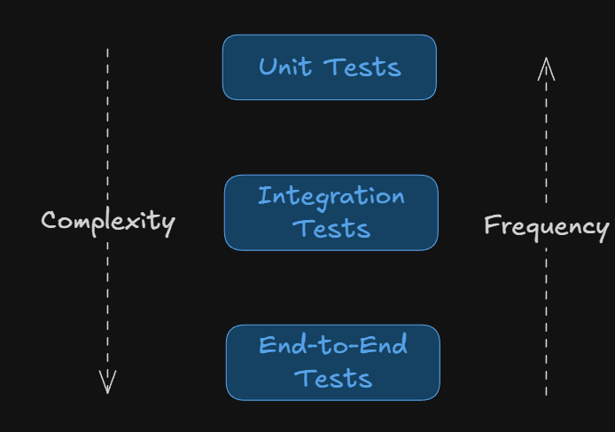
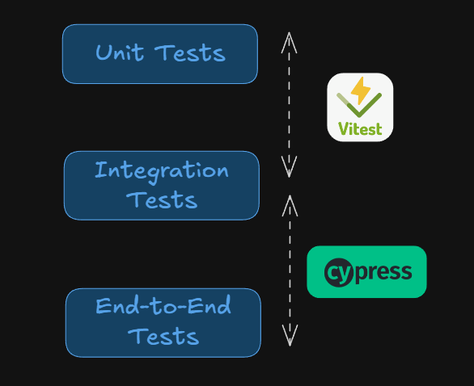

# Fullstack Development

---

# Preflight project - automated testing

- [Vitest](https://github.com/fullstack-69/pf-backend/tree/test)
- [Cypress](https://github.com/fullstack-69/pf-testing)

---

# Setup (Repos)

- [DB](https://github.com/fullstack-69/pf-db)
- [Backend](https://github.com/fullstack-69/pf-backend)
- [Frontend](https://github.com/fullstack-69/pf-frontend)

---

# Testing types

---

# Testing types

- Unit test
  - Tests individual code components.
- Interation test
  - Checks code dependency.
- End-to-end test
  - Assesses an application's functionality and user experience.

---

# Examples

| Test Type                | Example                                                    | Targeted Scope             |
| :----------------------- | :--------------------------------------------------------- | :------------------------- |
| Unit Testing             | Verifying that `add(x, y)` returns the sum of `x` and `y`. | Individual function/module |
| Integration Testing      | Testing authentication APIs                                | Combination of modules     |
| End-to-End (E2E) Testing | Simulating a user buying a product.                        | Full application workflow  |

---

# Testing frameworks

- [State of JS 2025](https://2025.stateofjs.com/en-US/libraries/testing/)

---

# Testing tools

---

# Storybook?

- Storybook is _overkill_ for this project.
- Why?
  - This project has 3 components, so they are easy to track.
  - I am not building a reusable UI library for multiple apps. Therefore, I don't need to maintain a separate Storybook project.

---

# Vitest

---

# Setup

_From your `pf-backend` repo_

- `pnpm install -D vitest supertest @types/supertest`
- Packages
  - `vitest` is a testing framework similar to Jest.
  - `supertest` is a library for testing HTTP servers.

---

# Setup files

- `package.json` Script [(Link)](https://github.com/fullstack-69/pf-backend/blob/ea31c937cccba0c7ddf6088b33a921de0a1588e0/package.json#L14)
- `vitest.config.ts` [(Link)](https://github.com/fullstack-69/pf-backend/blob/test/vitest.config.ts)

---

# Test files

`./src/index.test.ts`

- Minimal example [(Link)](https://github.com/fullstack-69/pf-backend/blob/test/src/index.min.test.ts)
- Full example [(Link)](https://github.com/fullstack-69/pf-backend/blob/test/src/index.test.ts)

---

# Cypress

---

# Setting up

- `pnpm init`
- `pnpm install cypress typescript dotenv @tsconfig/node-lts @tsconfig/node-ts @types/node`
- `pnpm approve-builds` (This might take a while to complete.)
- `pnpm exec cypress install` to manually install `Cypress` binary.
- `pnpm exec cypress verify` to verify the installation.

---

# Files

- `./tsconfig.json` [(Link)](https://github.com/fullstack-69/pf-testing/blob/main/tsconfig.json)
  - _Note this [issue](https://github.com/fullstack-69/pf-testing?tab=readme-ov-file#issue)_
- `./.env` from `.env.example` [(Link)](https://github.com/fullstack-69/pf-testing/blob/main/.env.example)
- `./.gitignore` [(Link)](https://github.com/fullstack-69/pf-testing/blob/main/.gitignore)
- Modify `./package.json` [(Link)](https://github.com/fullstack-69/pf-testing/blob/f3d9c250db0e8ca2e5b293c02d6891ad61b83e51/package.json#L7)

---

# Run your first test

- `npm run test`

---

# Cypress Browser

- Click `E2E Testing` ➡️ `Continue` ➡️ `Start E2E Testing in Chrome`
- Click `Create New Spec` ➡️ Name your spec (`min.cy.ts`) ➡️ Run spec

---

# Minimal example

- `./cypress/e2e/min.cy.ts` [(Link)](https://github.com/fullstack-68/pf-testing/blob/main/cypress/e2e/min.cy.ts)
- Check out [assertion](https://docs.cypress.io/app/references/assertions) and [actions](https://docs.cypress.io/api/table-of-contents#Actions).

---

# Full example

- Enable reading `.env`
  - `./cypress.config.ts` [(Link)](https://github.com/fullstack-68/pf-testing/blob/main/cypress.config.ts)
- Spec files
  - `./cypress/e2e/backend.cy.ts` [(Link)](https://github.com/fullstack-68/pf-testing/blob/main/cypress/e2e/backend.cy.ts)
  - `./cypress/e2e/frontend.cy.ts` [(Link)](https://github.com/fullstack-68/pf-testing/blob/main/cypress/e2e/frontend.cy.ts)
