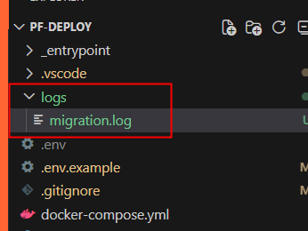
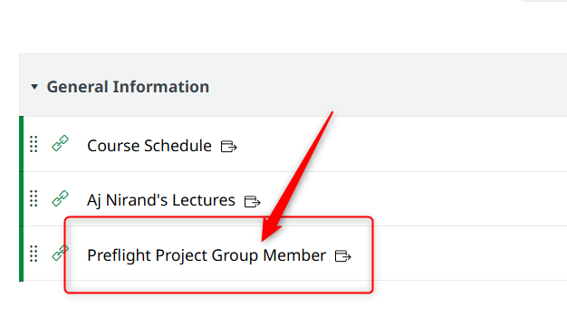

<style>
@import url('https://fonts.googleapis.com/css2?family=Prompt:ital,wght@0,100;0,300;0,400;0,700;1,100;1,300;1,400;1,700&display=swap');

    :root {
    font-family: Prompt;
    --hl-color: #D57E7E;
}
h1 {
  font-family: Prompt
}
img {
  border-radius: 0.5rem; 
}
</style>

# Fullstack Development

---

# Preflight project - deployment

[Github Repo](https://github.com/fullstack-68/pf-deploy)

---

# Local machine

---

# Clear your dev environment

- Remove all containers
  - Check with `docker ps -a`
  - `docker rm -f CONTAINER`
- Remove volumes
  - `docker volume prune -a`
- Remove all image cache
  - `docker image prune -a`
- Remove unused networks
  - `docker network prune`

---

# Setup

- `git clone https://github.com/fullstack-68/pf-deploy.git`
  - _Better yet, fork and clone this repo_
- `cd pf-deploy`
- Make `.env` from `.env.example` (Make necessary changes.)
- Take care of `./_entrypoint/init.sh`
  - Windows: Make sure that you save with LF option.
  - Mac/Linux: `chmod +x ./\_entrypoint/init.sh`
- `docker compose up -d --force-recreate`
- Use `docker compose logs` to inspect.

---

# File Permissions Issue

Consider the following volume mapping in your `docker-compose.yml`.

```yml
name: ${PROJECT_NAME}
services:
  backend:
    volumes:
      - ./logs:/app/logs
```

- On Linux, if you run `docker compose up`, the log files created in the `./logs` folder will have `root` ownership.
  - This is because the container runs as `root` user by default.
  - Your account (non-root) cannot delete these files.

---

# File Permissions Issue

- To fix this, you can create the folder and file beforehand.
- This is why I committed these files in the repo.



> Note: I experimented with `user: ${UID}:${GID}` in the `docker-compose.yml`. It has some issue with corepack.

---

# Remote server

---

# Setup

- `ssh USERNAME@10.10.x.x`
- Clone the `pf-deploy` repo
- Repeat steps we just did on local machine
  - Use the assigned `FRONTEND_PORT` or else the public url will not work.
- Check your container
  - `docker ps | less -S`
- Visit your public `url`.

---

# Setup

- Get server info from here.



---

# Note

- Docker images will not be updated automatically when you run `docker compose up -d`.
- You need to run `docker compose pull` to update the images.

---

# Recap

| Topic      | Stack                    |
| ---------- | ------------------------ |
| Language   | TypeScript               |
| DB         | PostgreSQL / Drizzle ORM |
| Backend    | Express                  |
| Frontend   | React / Vite             |
| Testing    | Cypress                  |
| Deployment | Docker / Nginx           |

---

# Congratuations!

> Now go and make awesome apps!
