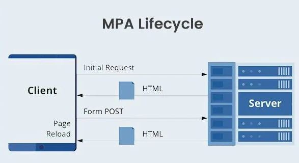
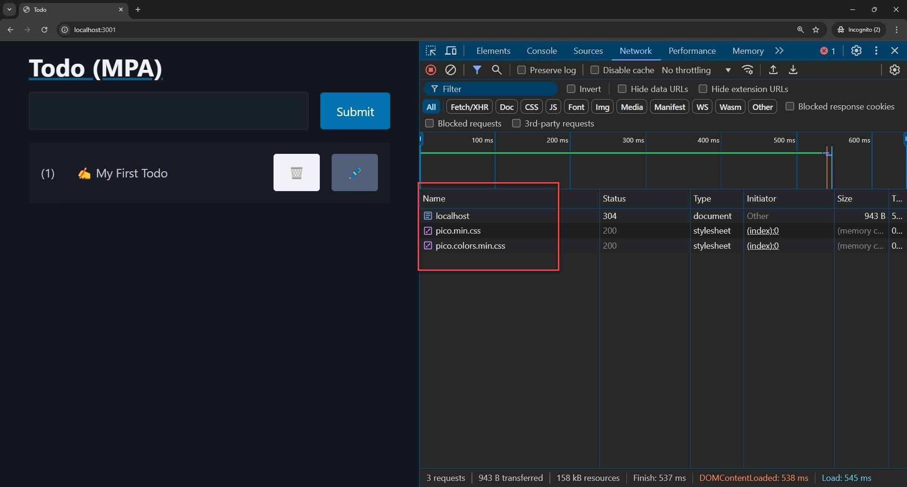
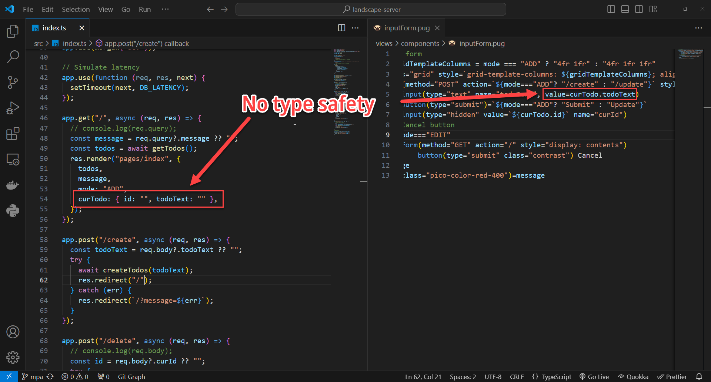
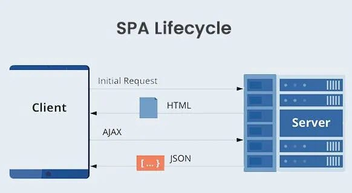
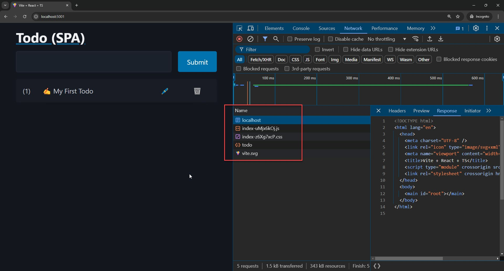
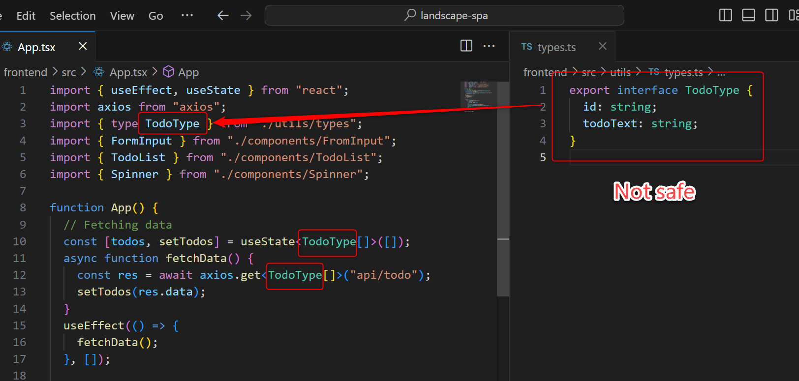
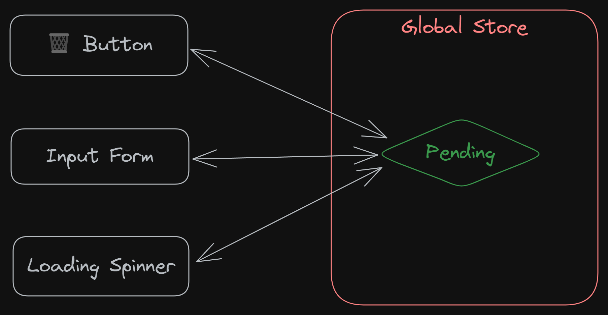

<style>
@import url('https://fonts.googleapis.com/css2?family=Prompt:ital,wght@0,100;0,300;0,400;0,700;1,100;1,300;1,400;1,700&display=swap');

    :root {
    font-family: Prompt;
    --hl-color: #D57E7E;
}
h1 {
  font-family: Prompt
}
img {
  border-radius: 0.5rem; 
}
</style>

# Fullstack Development

---

# Stack Overflow 2025 Developer Survey

- [Developer roles](https://survey.stackoverflow.co/2025/developers#developer-roles)

---

# Fullstack Landscape

> [Diagram](https://link.excalidraw.com/l/9PltHIQHZMD/4zVYOlJ54Ee)

_Inspired from this [VDO](https://youtu.be/eBy6LJvv8B0?si=pqadLrws587NmCeO)._

---

# Part 1: The battle of the architectures

> MPA vs SPA vs HTMX

---

# Multi-page application (MPA)

> The web's default architecture (1991–2000s)

---

# History

- `1990–91`: Tim Berners-Lee's WWW — static hypertext documents only
- `1993`: CGI — first standard way for a server to generate HTML dynamically
- `1995–99`: PHP, ASP, JSP — server-side scripting goes mainstream
- `2004–05`: Rails, Django — opinionated MVC frameworks standardize the pattern
- **Model**: every interaction = new HTTP request = full page reload

---

# Multi-page application

- Loads a new page every time you perform an action.
- Traditional web applications.
- Use server-side technologies
  - PHP, Ruby on Rails, ASP.NET, Java, and Node JS.
- Can include JavaScript (`script`) for client-side interactivity

---



---

# Todo app (MPA)

- `Express JS` + `Pug` (renderer)

---

# Get started

- `git clone https://github.com/fullstack-68/landscape-mpa.git mpa`
- `cd mpa`
- `pnpm install`
- `pnpm run build`
- `pnpm run start`

---

# Endpoint

`./src/index.ts`

```ts
app.get("/", async (req, res) => {
  const message = req.query?.message ?? "";
  const todos = await getTodos();
  // Output HTML
  res.render("pages/index", {
    todos,
    message,
    mode: "ADD",
    curTodo: { id: "", todoText: "" },
  });
});
```

---

# Renderer

`./view/pages/index.pug`

```ts
body
    main(class="container")
        a(href="/")
            h1 Todo (MPA)
        div(id="todoform")
            include ../components/inputform.pug
        div(id="todolist")
            include ../components/todolist.pug
```

---



_Use incognito mode to avoid loading chrome extensions._

---

# Note

- Every button is wrapped in a separate form
  - Need to trigger different endpoints.
- Need to use `input(type="hidden)` to encode additional information.

```js
form(action="/delete" method="POST" style="display: contents")
  input(type="hidden" value=`${todo.id}` name="curId")
  button(type="submit" class="contrast" style="margin-bottom: 0") 🗑️
form(action="/edit" method="POST" style="display: contents")
  input(type="hidden" value=`${todo.id}` name="curId")
  button(type="submit" class="secondary" style="margin-bottom: 0") 🖊️
```

---



---

# Single-page application (SPA)

> The "thick client" era (2004–2010s)

---

# History

- `2004`: Gmail launches — async UI updates without page reloads
- `Feb 2005`: Google Maps launches; Jesse James Garrett coins "Ajax"
- `2006`: jQuery — makes AJAX/DOM manipulation practical for everyone
- `2010–14`: Backbone/Knockout → AngularJS (2010) → React (2013) → Vue (2014)
- **Shift**: XML → JSON, server becomes an API, client owns rendering + state
- **Model**: one HTML shell, JavaScript renders everything client-side

---

# Single-page application

- Single-page application
  - Loads a single HTML page and dynamically updates the content as the user interacts with the app.
- Use frontend and backend frameworks separately.

---



---

# Todo app (SPA)

- `Express JS` + `React`

---

# Get started

- `git clone https://github.com/fullstack-68/landscape-spa.git spa`
- Backend
  - `cd spa/backend`
  - `pnpm install`
  - `pnpm run build`
  - `pnpm run start`

---

# Get started (cont.)

- Frontend
  - `cd spa/frontend`
  - `pnpm install`
  - `pnpm run build`
  - `pnpm run preview`

---



---



---

# Global store

- `zustand`
  

---

# HTMX

> The hypermedia revival (2013–present)

---

# What exactly is HTMX?

> Small JS library that can swap parts of UI with **_HTML response_** from a server.

[#1 2024 JavaScript Rising Stars](https://risingstars.js.org/2024/en#section-framework)

---

# History

- `2013`: Carson Gross builds Intercooler.js to fix slow client-side table sorting
  - Users tell him: "this is RESTful" → sends him back to Roy Fielding's dissertation
  - Fielding's 2008 essay: most "REST APIs" ignore HATEOAS (hypermedia constraint)
- `Nov 24, 2020`: rewritten and relaunched as htmx — drops jQuery dependency

---

# History

- `2022–23`: viral adoption, framed as reaction to SPA/build-tooling fatigue
  July 2023: Hypermedia Systems book — names the category "Hypermedia-Driven Application"
- **Model**: server renders HTML fragments, JS library swaps them into the DOM

---

# Get started

- `git clone https://github.com/fullstack-68/landscape-htmx.git htmx`
- `cd htmx`
- `pnpm install`
- `pnpm run build`
- `pnpm run start`

---

# Todo app

- The stack is very similar to MPA (`express` + `pug`).
- SSR enabled _(duh!)_
- No reloading
- Spinner enabled
- Form input disabled during submission.

---

# In addition

- [Hypermedia as the Engine of Application State (HATEOAS)](https://htmx.org/essays/hateoas/)

- [HTMX + Alpine.js](https://dev.to/nicholas_moen/what-i-learned-while-using-django-with-htmx-and-alpine-js-24jg)

---

# App Comparison

---

# UX

| Item              | MPA | SPA | HTMX |
| ----------------- | --- | --- | ---- |
| No page-refresh   | ❌  | ✅  | ✅   |
| Spinner           | ❌  | ✅  | ✅   |
| Element disabling | ❌  | ✅  | ✅   |

---

# App comparison (technical)

| Item                  | MPA | SPA | HTMX |
| --------------------- | --- | --- | ---- |
| Amount of `JS` loaded | ✅  | ❌  | ✅   |
| HTML content (SEO)    | ✅  | ❌  | ✅   |
| State in URL          | ✅  | ❌  | ✅   |

---

# DX

| Item                 |        MPA |     SPA |       HTMX |
| -------------------- | ---------: | ------: | ---------: |
| Number of frameworks |       1 ✅ |    2 ❌ |       1 ✅ |
| Complexity           |    Less ✅ | More ❌ |    Less ✅ |
| Lines of code        |    Less ✅ | More ❌ |    Less ✅ |
| Type Safety          |    Less ❌ | More ✅ |    Less ❌ |
| Hot reloading        | Partial ❌ | Full ✅ | Partial ❌ |

---

# Code count

| Type     | # Line |
| :------- | -----: |
| MPA      |    203 |
| SPA      |    504 |
| **HTMX** |    259 |

---

# Summary

| Architecture | Usage                                      |
| ------------ | ------------------------------------------ |
| MPA          | Backend-critical (financial, ERP, ทะเบียน) |
| SPA          | Dashboards, editor                         |
| HTMX         | Apps that finish on time                   |
